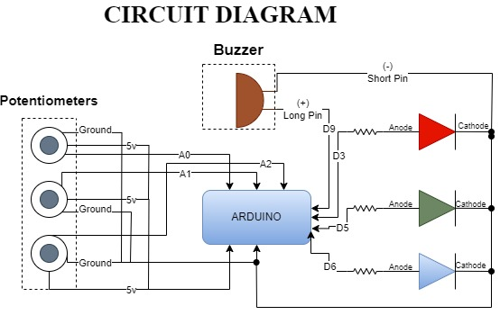

# Arduino + p5.js Interactive Project

# **Color Picker Game Using Potentiometer**

# Milestone3

## Project Overview
The **Color Picker Game Using Potentiometer** is an interactive project that combines physical computing with digital interactivity. Players manipulate three potentiometers to adjust Red, Green, and Blue (RGB) color values, attempting to match a randomly generated target color displayed on a digital interface. The project blends hardware (Arduino) and software (p5.js) to provide a fun, educational experience about RGB color mixing, with real-time feedback through visual, auditory, and numerical cues.

---

## System Description

### Gameplay Flow
1. Players use three potentiometers to adjust the RGB values.
2. The selected color is displayed on a p5.js canvas alongside the target color.
3. Feedback includes:
   - **RGB LED**: Displays the selected color in real-time.
   - **Buzzer**: Emits tones based on the accuracy of the match.
   - **Score Display**: Shows a percentage score indicating the match.
4. The game is timed, and new target colors are generated for each round.

---

## Diagrams

### **System Diagram**
The following system diagram outlines how the components interact in the game:


- **Inputs**: Three potentiometers provide analog signals to the Arduino.
- **Processing**: Arduino reads the signals and calculates RGB values. These values are sent to p5.js via serial communication.
- **Outputs**:
  - p5.js displays the target and selected colors, calculates the score, and controls the gameplay logic.
  - Arduino controls the RGB LED and buzzer for physical feedback.

---

### **FSM Diagram**
The Finite State Machine (FSM) diagram defines the states of the game and their transitions:


1. **Start Screen**: Display instructions and await player input to start.
2. **Gameplay**: Players adjust potentiometers to match the target color.
3. **Scoring**: System calculates and displays match score.
4. **Game Over**: Displays results and resets the game.

Transitions are driven by:
- Timer countdown.
- Player input (e.g., button press).

---

### **Circuit Diagram**
The circuit connects the hardware components for the game:



- **Potentiometers**: Connected to analog pins of the Arduino.
- **RGB LED**: Connected to digital pins through current-limiting resistors.
- **Buzzer**: Connected to a digital pin for sound output.

---

## Hardware and Software Requirements

### **Hardware**
- Arduino Uno or Nano.
- RGB LED with 220Ω resistors for each channel (R, G, B).
- 3 Potentiometers (10kΩ).
- Piezo Buzzer.
- Breadboard, jumper wires, and USB cable.

### **Software**
- **Arduino IDE**: Program the Arduino to handle inputs and outputs.
- **p5.js**: Create the interactive game interface.
- **Serial Communication**: Enable communication between Arduino and p5.js.

---

## Features and Feedback Mechanisms

### **Core Features**
- **Physical Input**: Potentiometers allow fine control over RGB values.
- **Real-Time Feedback**:
  - RGB LED mirrors the selected color.
  - Buzzer plays tones based on match accuracy.
  - Canvas displays target and selected colors.

### **Feedback Details**
- **Visual**:
  - Canvas dynamically updates with RGB values and match percentage.
  - RGB LED reflects the selected color.
- **Auditory**:
  - High-pitched tone for matches >90%.
  - Low-pitched tone for matches <50%.
- **Numerical**:
  - Match score displayed as a percentage.

---

## External Libraries
- **Arduino**:
  - `Servo.h` (if used for expanding the project).
  - `Tone` library for buzzer tones.
- **p5.js**:
  - `p5.sound` for sound effects.
  - `p5.serialport` for Arduino communication.

---

## Sensors and Components

### **Input**
- **Potentiometers**: Adjust RGB values.

### **Output**
- **RGB LED**: Visualizes selected RGB color.
- **Buzzer**: Auditory feedback for match accuracy.

---

## User Testing Plan

- **Objective**: Test the intuitiveness, engagement, and educational value of the game.
- **Methods**:
  - Observe users adjusting potentiometers and interpreting feedback.
  - Record scores and time taken to match colors.
  - Collect qualitative feedback on gameplay experience.
- **Metrics**:
  - Time to complete matches.
  - User feedback on difficulty and engagement.
  - Understanding of RGB mixing concepts.

---

## Deliverables

1. **Working Prototype**:
   - Functional circuit with Arduino controlling the RGB LED and buzzer.
   - Basic gameplay implemented in p5.js.
2. **Code**:
   - Arduino code for input and feedback.
   - p5.js code for game interface and logic.
3. **Updated Diagrams**:
   - Refined system, circuit, and FSM diagrams.

#### **Scoring Logic**
The game calculates how closely the player's selected color matches the target color using the following logic:

## Pseudocode:
```plaintext
Setup:
    Initialize serial communication between Arduino and p5.js.
    Set up pin modes for:
        - LEDs (Output pins for Red, Green, Blue LEDs).
        - Potentiometers (Analog input pins for Red, Green, Blue adjustments).
    Initialize timer and game state variables:
        - timer = 60 seconds (for countdown).
        - state = "Start Screen" (initial state).
    Generate a random target color using generateTargetColor().

Function calculateMatch(selectedColor, targetColor):
    Input: selectedColor (RGB array), targetColor (RGB array)
    Output: matchPercentage (0-100%)

    Calculate the Euclidean distance between selectedColor and targetColor:
        distance = sqrt(
            (selectedColor[0] - targetColor[0])^2 +
            (selectedColor[1] - targetColor[1])^2 +
            (selectedColor[2] - targetColor[2])^2
        )
    
    Normalize the distance to a percentage score:
        maxDistance = sqrt(255^2 + 255^2 + 255^2) // Maximum possible distance
        matchPercentage = (1 - (distance / maxDistance)) * 100

    Return matchPercentage
Initialize:
    timer = 60 seconds // Total time for the game round

Loop:
    Decrease the timer based on elapsed time:
        elapsedTime = currentTime - lastUpdateTime
        timer = timer - elapsedTime

    If timer <= 0:
        Transition to "Scoring" state

Function generateTargetColor():
    Input: None
    Output: targetColor (RGB array)

    Generate random values for Red, Green, and Blue:
        red = random(0, 255)
        green = random(0, 255)
        blue = random(0, 255)

    Return targetColor = [red, green, blue]


---
```
## **Milestone 2: Project Proposal, Planning, and Organizing**

### **1. Project Overview**
This project transforms a simple potentiometer-controlled color picker into an interactive color-matching game. Players will use three potentiometers to adjust Red, Green, and Blue (RGB) color values, attempting to match a randomly generated target color displayed on the p5.js interface. Feedback will be provided in real-time, with scores indicating how closely the player’s selected color matches the target.

The system combines Arduino hardware (potentiometers, RGB LEDs, and a buzzer) with p5.js for an engaging experience that explores how physical inputs can interact with visual outputs creatively.

---

### **2. Key Objectives**

#### **Gameplay Experience:**
- Develop an interactive game where players match colors using physical controls.
- Provide real-time visual, auditory, and numerical feedback to enhance engagement.

#### **Educational Element:**
- Help users understand the relationship between physical potentiometer adjustments and RGB color mixing.

#### **Creative Expression:**
- Integrate sound effects, animations, and a progression system to create a user experience.

---

### **3. Project Features**

#### **Core Features:**
- Use three potentiometers to adjust RGB values.
- Display the target color and selected color on the p5.js canvas.
- Score the match based on the percentage similarity between the target and selected colors.
- Output the selected color to an RGB LED in real time.
- **Buzzer Feedback**: Play tones to indicate high or low match scores.

#### **Interactive Gameplay:**
- A timer to add urgency to the gameplay.
- Randomly generated target colors for each round.

#### **Feedback Mechanisms:**
- Display a score indicating the match percentage.
- Provide visual and auditory feedback using animations, RGB LED, and buzzer.

#### **Scalability:**
- Potential for additional levels or multiplayer functionality in future iterations.

---

### **4. Narrative and Engagement**

#### **Narrative:**
Players act as futuristic digital artists tasked with "restoring" corrupted digital art by matching its original colors using physical controls. The experience immerses players in a blend of physical and digital interactions.

#### **Feelings to Convey:**
- **Challenge**: Time pressure and scoring encourage focus and precision.
- **Satisfaction**: Real-time feedback (visual, auditory, and tactile) rewards player success.

---

### **5. Hardware and Software Requirements**

#### **Hardware:**
- Arduino Board (e.g., Uno, Nano)
- RGB LED
- 3 Potentiometers (10kΩ)
- Resistors (220Ω - 330Ω)
- Buzzer (Piezo Speaker)
- Breadboard and Jumper Wires
- USB Cable

#### **Software:**
- Arduino IDE
- p5.js (JavaScript Library)
- Serial Communication between Arduino and p5.js

---

### **6. Implementation Plan**

#### **Phase 1: Setup and Testing (Dec 2 – Dec 5)**
- Assemble the circuit with Arduino, potentiometers, RGB LED, and buzzer.
- Test individual components:
  - Reading potentiometer values.
  - Controlling RGB LED brightness.
  - Generating tones with the buzzer.

#### **Phase 2: p5.js Integration (Dec 6 – Dec 10)**
- Set up serial communication between Arduino and p5.js.
- Display RGB values on the p5.js canvas.
- Test the live adjustment of colors with potentiometer inputs.

#### **Phase 3: Game Development (Dec 11 – Dec 14)**
- Implement the color-matching gameplay logic:
  - Random target color generation.
  - Scoring algorithm (percentage match).
  - Timer and feedback mechanisms.
- Add buzzer tones for:
  - High matches (pleasant sound).
  - Low matches (dissonant sound).
- Add animations and visual feedback.

#### **Phase 4: Testing and Refinement (Dec 15 – Dec 16)**
- Test the entire system for usability, accuracy, and performance.
- Refine based on user feedback or identified bugs.

---

### **7. Timeline**

| Task                          | Due Date  | Status   |
|-------------------------------|-----------|----------|
| Assemble and test hardware     | Dec 5     | Pending  |
| Implement serial communication | Dec 10    | Pending  |
| Game logic and buzzer integration | Dec 14 | Pending  |
| Final testing and refinement   | Dec 16    | Pending  |

---

### **8. Expected Outcomes**
- A functional color-matching game with an interactive hardware interface.
- Real-time visual, auditory, and numerical feedback.
- A polished gameplay experience that integrates physical and digital components seamlessly.

--------------

## **Milestone 1: Project Ideas and Diagrams**
## Idea 1. Digital Dice  
### Description  
A button press rolls a digital dice. The dice roll result is displayed on a **p5.js canvas**, and the Arduino lights up LEDs corresponding to the dice number.  

### How It Works  
- The button triggers a dice roll in **p5.js**.  
- **p5.js** generates a random number (1 to 6) and sends it to the Arduino via serial.  
- The Arduino lights up the corresponding number of LEDs.  
 
---

## Idea 2. Interactive Reaction Timer Game  
### Description  
A simple game where the player reacts as quickly as possible to an LED lighting up. The reaction time is displayed in **p5.js**, along with a leaderboard.  

### How It Works  
- The Arduino lights up an LED randomly.  
- The player must press the button as quickly as possible.  
- The Arduino sends the reaction time to **p5.js**, which displays it on the screen and updates the leaderboard.

---

## Idea 3. Color Picker Using a Potentiometer  
### Description  
A potentiometer is used to adjust colors dynamically in a **p5.js sketch**. The selected color is also displayed on an RGB LED connected to the Arduino.  


### How It Works  
- The potentiometer position is read by the Arduino and sent to **p5.js** via serial.  
- **p5.js** updates a shape's color or the canvas background dynamically based on the potentiometer's position
